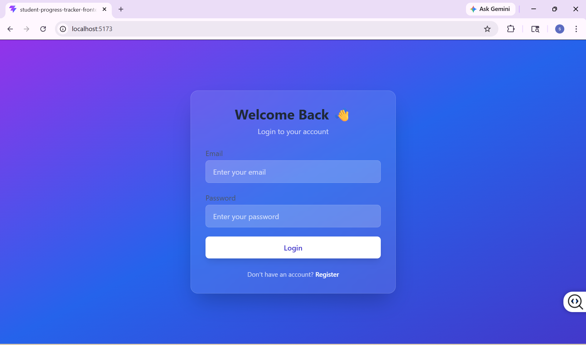
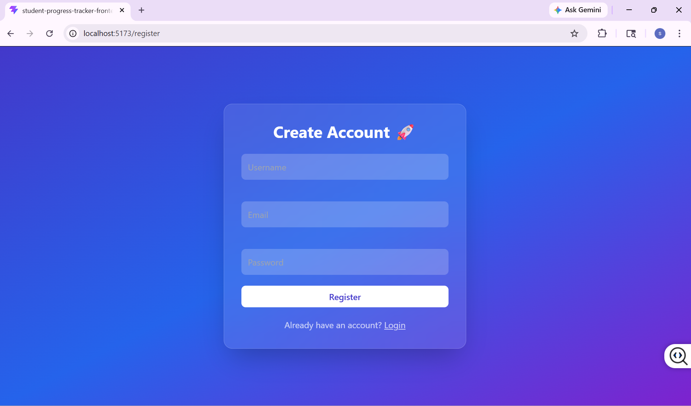
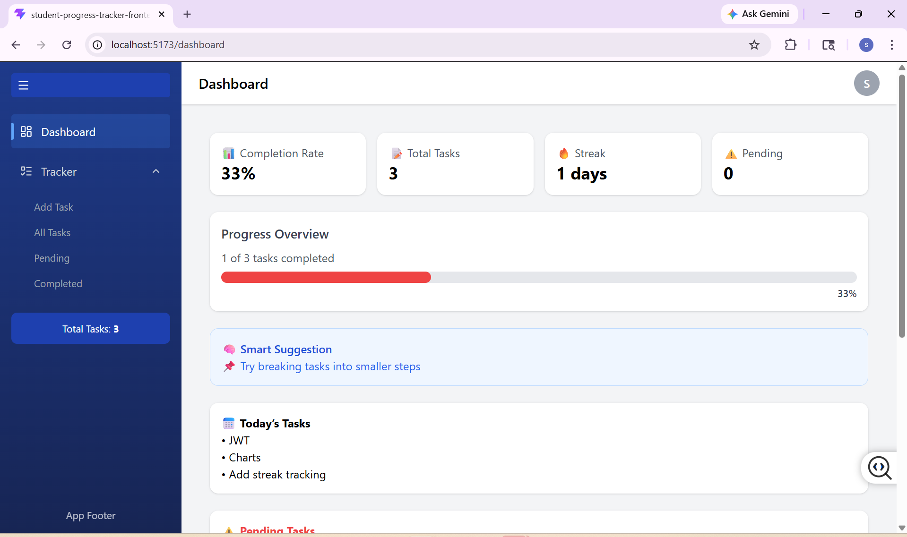
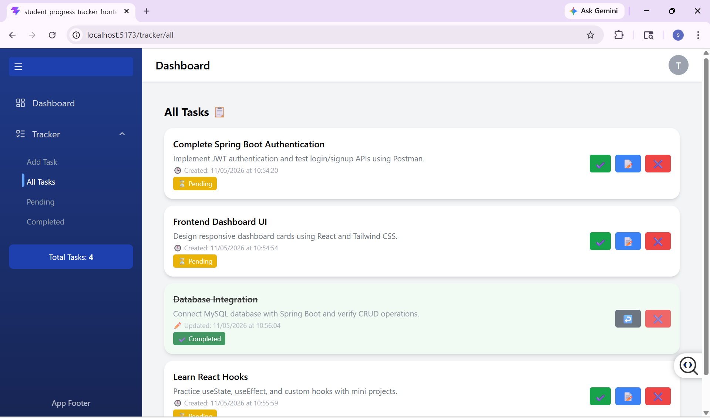
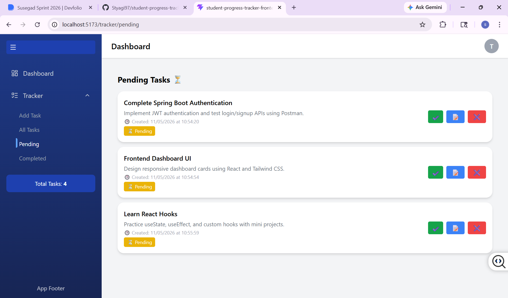
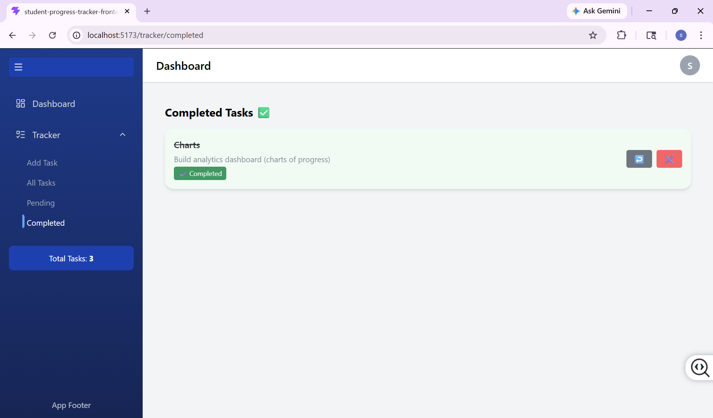
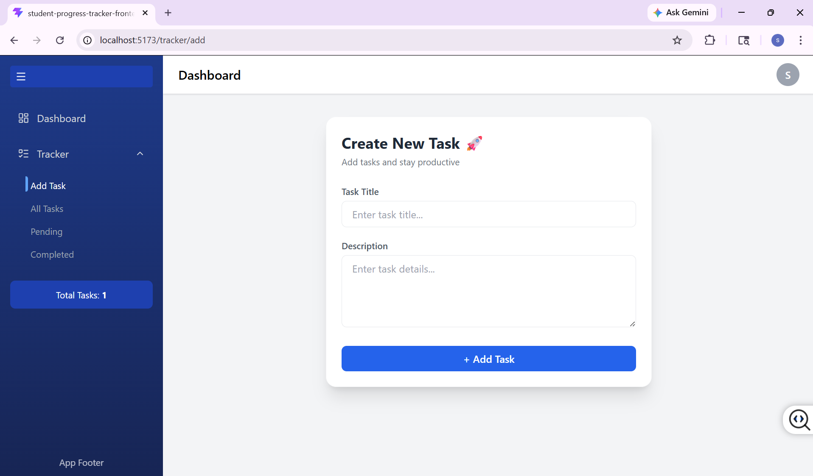

# 🚀 Student Progress Tracker

> A full-stack productivity & task management system with smart analytics, streak tracking, and backend-driven suggestions.

---

## ✨ Key Highlights

- 🔐 JWT-based Authentication system  
- 📝 Full Task Management (CRUD operations)  
- 📊 Smart Analytics Dashboard  
- 🔥 Daily Streak Tracking System  
- 🧠 Intelligent Suggestion Engine (Backend AI logic)  
- ⏰ Weekly Productivity Reports (Spring Boot Scheduler)  

---

## 🛠 Tech Stack

### 💻 Frontend
- React (Vite)
- Tailwind CSS
- Axios
- Context API

### ⚙️ Backend
- Spring Boot
- Spring Security
- JWT Authentication
- JPA / Hibernate

### 🗄 Database
- MySQL

---

## 📸 Screenshots

### 🔐 Login Page


### 📝 Register Page


### 📊 Dashboard


### 📋 All Tasks


### ⏳ Pending Tasks


### ✅ Completed Tasks


### ➕ Add Task



## ✨ Features

### 🔐 Authentication
- User Registration & Login
- JWT-based authentication
- Secure session handling

### 📝 Task Management
- Create, update, delete tasks
- Track completed & pending tasks
- Due date support

### 📊 Smart Dashboard
- Daily completion rate
- Visual progress bar
- Task analytics

### 🔥 Streak System
- Tracks consecutive productive days
- Encourages consistency

### 🧠 Smart Suggestion Engine (Backend)
- Suggests next action based on:
  - Overdue tasks
  - Today’s tasks
  - Completion rate

### ⏰ Automation
- Weekly report scheduler (Spring Boot)
- Logs productivity insights
 

---

### 📡 API Endpoints

### 🔐 Authentication APIs

- POST `/api/auth/register` → Register user  
- POST `/api/auth/login` → Login user  
- POST `/api/auth/logout` → Logout user  


### 📋 Task APIs

- GET `/api/tasks/{userId}` → Get all tasks  
- POST `/api/tasks` → Create task  
- PUT `/api/tasks/{id}` → Update task  
- DELETE `/api/tasks/{id}` → Delete task 


### 📊 Analytics APIs 

- GET `/api/tasks/today/{userId}` → Today tasks  
- GET `/api/tasks/pending/{userId}` → Pending tasks  
- GET `/api/tasks/overdue/{userId}` → Overdue tasks  
- GET `/api/tasks/completion-rate/{userId}` → Completion rate  
- GET `/api/tasks/suggestion/{userId}` → Smart suggestion  


## 📁 Project Structure

```
student-progress-tracker/
│
├── student-progress-tracker-backend/
│   └── Spring Boot API
│
├── student-progress-tracker-frontend/
│   └── React App
│
└── README.md
```

---

## ⚙️ Setup Instructions

### 1️⃣ Clone the Repository

```
git clone https://github.com/Styagi97/student-progress-tracker
cd student-progress-tracker
```

---

## 🔧 Backend Setup

```
cd student-progress-tracker-backend
mvn spring-boot:run
```

Backend runs on:

```
http://localhost:8080
```

---

## 💻 Frontend Setup

```
cd student-progress-tracker-frontend
npm install
npm run dev
```

Frontend runs on:

```
http://localhost:5173
```

---

## 🌍 Environment Variables

Create a `.env` file inside **student-progress-tracker-frontend/**

```
VITE_API_URL=http://localhost:8080/api
```

---

## 📊 Smart Features

* 🧠 Backend-driven suggestion system
* 📅 Daily & Weekly analytics
* 🔥 Automatic streak calculation
* ⚠ Overdue detection based on due dates

---

## 🚀 Future Improvements

* 🔔 Task Reminder Notifications
* 📧 Email Weekly Reports
* 🌐 Deployment (Vercel + Render)
* 📱 Mobile Responsive UI Enhancements

---

## 👩‍💻 Author

**Shivani Tyagi**
 
